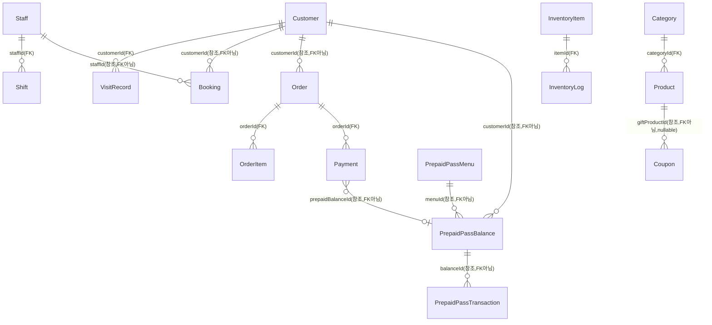

# 전체 화면 기능 목록 + ERD + 테이블 정의 + 샘플 데이터

> **범위/원칙**
> - 화면 기준: `design/mockups/v2/ja_toss100/` 전체 27개 파일(00~33번)
> - 엔티티 기준: 현재 `lib/features/*/data/*_tables.dart`에 **실제 구현되어 있는** 21개 테이블만 사용. `design/spec/v3/*/data_spec.md`에 문서로만 적혀있고 코드로 없는 항목(OptionGroup, Branch 등)은 §4로 분리했다.
> - 본 문서는 **분석/설계 문서**다 — Dart 코드, SQL(CREATE TABLE/INSERT)을 생성하지 않는다. 기존 Drift 테이블 구조도 임의로 바꾸지 않고 있는 그대로 기록한다.
> - 작성일: 2026-06-23

---

## 1. 화면별 기능 목록 (전체 27화면)

상태 표기: ✅ Flutter로 구현됨(`lib/features/`) / 📄 목업(HTML)만 존재, 미구현.

### 1-0. 공통/시스템

| 화면 | 상태 | 기능 |
|---|---|---|
| 00_design_system | 📄 | 색상·타이포·컴포넌트 스타일 가이드(기능 화면 아님, 디자인 토큰 참고용) |
| 01_login_main | 📄 | PIN 6자리 입력 로그인(숫자패드+점 표시). 백엔드 인증 엔티티 없음(§4-4 참조) |
| 01_login_main_b | 📄 | 로그인+레지(開店) 게이트 결합형 변형 — 로그인 성공 시 바로 개점준비로 진입 |

### 1-1. 決済・POS

| 화면 | 상태 | 기능 |
|---|---|---|
| 02_pos_order | ✅ | 카테고리별 메뉴 타일(카테고리 고정색), 카트(수량±), 결제 다이얼로그 진입 |
| 03_pos_payment | 📄 | 결제수단 선택(현금/카드/QR 등), 분할결제 3-tab(금액/더치페이/메뉴별) UI |
| 04_pos_complete | 📄 | 결제완료 화면, 영수증 발행대상(개인/사업자)·자진발행 선택 |
| 05_transaction_history | 📄 | 결제 이력 리스트(일자별), 취소(환불) 진입점 |

### 1-2. 予約

| 화면 | 상태 | 기능 |
|---|---|---|
| 06_booking_calendar | 📄 | 담당자별 컬럼 캘린더, 예약 블록(담당자컬러 파스텔), 노쇼 칩, 클릭 시 상세 팝업 |
| 06_booking_calendar_b | 📄 | 동일 데이터의 타임라인(가로) 대체 뷰 |
| 07_booking_form | 📄 | 고객검색/신규등록, 메뉴 선택, 담당자 지정(空き/予約あり/休み), **予約金**(F-BOOK-02a), 정기예약, 메모 |
| 08_waiting_list | ✅ | 워크인 대기열 추가/호출/취소, 대기시간 경과 색상(10분/20분 경계) — 토스 근거 없는 독자기능 |

### 1-3. 顧客管理

| 화면 | 상태 | 기능 |
|---|---|---|
| 09_customer_list | ✅ | 고객 검색, 그룹탭(初回来店/予備常連/常連/休眠ぎみ — 동적 자동분류), 신규등록 |
| 10_customer_detail | 📄 | 고객 메모(오너전용), 포인트±, 선불권 카드, 방문통계, 시술기록(카르테) 탭 |

### 1-4. スタッフ

| 화면 | 상태 | 기능 |
|---|---|---|
| 11_staff_list | 📄 | 직원 목록(이름/연락처/소속점/근무상태) — 권한·PIN 컬럼 없음(F-STAFF-00) |
| 12_staff_detail | 📄 | 기본정보·실적 표시, "PIN·권한 변경은 통근관리사이트 전용" 안내 |
| 13_staff_shift | 📄 | 주간/월간 근무표, 06/07의 담당자 가용여부 판정 소스 |
| 33_staff_accounts | ✅ | 매출장부 연동 직원 초대(이름+연락처), 상태(待機中/連結済み), 재전송/삭제 |

### 1-5. 商品・カテゴリ・在庫

| 화면 | 상태 | 기능 |
|---|---|---|
| 25_product_list | 📄 | 카테고리/상품 목록, 등록모달(색상스와치, 카테고리 단일선택, 가격/시가, 옵션 칩 다중선택) |
| 26_product_form | 📄 | 25로 통합된 리다이렉트 전용(`?openId=N` 쿼리로 편집모달 자동오픈) |
| 14_inventory_list | ✅ | 소모성 자재 재고현황(正常/不足/品切れ), 수량±조정 — 商品/決済와 의도적 미연동(F-INV-00) |
| 15_inventory_history | 📄 | 재고 변동 이력(입고/사용/폐기/조정) 일자별 조회 |

### 1-6. 売上レポート

| 화면 | 상태 | 기능 |
|---|---|---|
| 17_reports_dashboard | ✅ | 일/주/월 토글, 実売上/注文件数/返品, 決済手段別売上 — 자체 테이블 없이 Order/Payment 집계 |

### 1-7. マーケティング

| 화면 | 상태 | 기능 |
|---|---|---|
| 19_coupon_management | ✅ | 시즌템플릿 쿠폰 발행(3-step: 시즌→혜택→유효기간), 영수증쿠폰번호(로또/암구호) |
| 20_campaign | 📄 | 조건부 자동할인 캠페인 생성/토글 — 토스 근거 없는 독자기능 |
| 21_point_policy | 📄 | 포인트 정책(적립률/최소사용포인트/적립·사용대상상품), 보너스(포인트가치/유효기간/로열티티어) |

### 1-8. 店舗設定

| 화면 | 상태 | 기능 |
|---|---|---|
| 22_store_open | ✅ | 권종별(枚/個) 카운트, 총액 표시, 전일마감액 대비 차액, 개점확정 |
| 23_store_close | 📄 | 당일매출 요약, 권종 카운트, 폐점 체크리스트(4항목) 게이팅, 폐점확정 |

> **참고**: ✅ 9개 화면은 Flutter로 구현되어 Drift DB와 직접 연동된다(§2/§3의 테이블이 그 근거). 📄 18개 화면은 HTML 목업 단계이며, 본 문서 §2의 ERD는 ✅ 화면이 실제로 사용하는 엔티티 기준으로 작성했다(📄 화면이 향후 구현될 때 §4의 제안 엔티티가 필요해질 수 있음).

---

## 2. ERD (현재 구현된 엔티티 기준)

### 2-1. 관계 다이어그램

### 2-2. FK 강도 주석 (중요)

Drift 코드를 그대로 기준으로 삼으면, **테이블 간 참조 중 실제로 `.references()`로 외래키 제약이 걸린 것은 일부뿐**이고 나머지는 단순 문자열 컬럼(애플리케이션 레벨에서만 의미있는 참조)이다. 임의로 통일하지 않고 있는 그대로 구분해서 기록한다.

| 참조 | 제약 종류 |
|---|---|
| Product.categoryId → Category.id | **FK 제약 있음**(`KeyAction.restrict`) |
| Shift.staffId → Staff.id | **FK 제약 있음**(`KeyAction.cascade`) |
| VisitRecord.customerId → Customer.id | **FK 제약 있음**(`KeyAction.cascade`) |
| OrderItem.orderId → Order.id | **FK 제약 있음**(`KeyAction.cascade`) |
| Payment.orderId → Order.id | **FK 제약 있음**(`KeyAction.cascade`) |
| InventoryLog.itemId → InventoryItem.id | **FK 제약 있음**(`KeyAction.cascade`) |
| Booking.customerId / staffId | 제약 없음(일반 text 컬럼) |
| Order.customerId | 제약 없음(nullable text) |
| OrderItem.productId / staffId | 제약 없음 |
| WaitingEntry.preferredStaffId | 제약 없음(nullable) |
| PrepaidPassBalance.customerId / menuId | 제약 없음 |
| PrepaidPassTransaction.balanceId / relatedOrderId | 제약 없음 |
| Payment.prepaidBalanceId | 제약 없음(nullable) |
| InventoryLog.staffId | 제약 없음(nullable) |
| Coupon.giftProductId | 제약 없음(nullable) |
| CashCount.confirmedBy | 제약 없음(nullable, Staff.id 추정) |

---

## 3. 테이블 정의 (구현된 21개 모델 그대로 — 변경 없음)

### 3-1. product 모듈

**Category**

| 컬럼 | 타입 | 제약/기본값 |
|---|---|---|
| id | TEXT | PK |
| name | TEXT | length 1~30 |
| colorHex | TEXT | length 7(`#RRGGBB`) |
| kioskVisible | BOOLEAN | default true |
| sortOrder | INTEGER | default 0 |

**Product**

| 컬럼 | 타입 | 제약/기본값 |
|---|---|---|
| id | TEXT | PK |
| name | TEXT | length 1~60 |
| categoryId | TEXT | FK → Category.id, ON DELETE RESTRICT |
| price | INTEGER | NOT NULL |
| allowCustomPrice | BOOLEAN | default false |
| kioskVisible | BOOLEAN | default true |
| durationMin | INTEGER | nullable |
| displayStock | INTEGER | nullable |

### 3-2. staff 모듈

**Staff**

| 컬럼 | 타입 | 제약/기본값 |
|---|---|---|
| id | TEXT | PK |
| name | TEXT | length 1~30 |
| phone | TEXT | NOT NULL |
| role | TEXT | default 'スタイリスト'（표시 전용） |
| accountStatus | TEXT | nullable（待機中/連結済み） |
| invitedAt | DATETIME | nullable |

**Shift**

| 컬럼 | 타입 | 제약/기본값 |
|---|---|---|
| id | TEXT | PK |
| staffId | TEXT | FK → Staff.id, ON DELETE CASCADE |
| date | DATETIME | NOT NULL |
| startTime | DATETIME | nullable（null=휴무） |
| endTime | DATETIME | nullable |

### 3-3. customer 모듈

**Customer**

| 컬럼 | 타입 | 제약/기본값 |
|---|---|---|
| id | TEXT | PK |
| name | TEXT | length 1~30 |
| phone | TEXT | NOT NULL |
| memo | TEXT | nullable |
| points | INTEGER | default 0 |
| birthday | DATETIME | nullable |
| createdAt | DATETIME | NOT NULL |

**VisitRecord**

| 컬럼 | 타입 | 제약/기본값 |
|---|---|---|
| id | TEXT | PK |
| customerId | TEXT | FK → Customer.id, ON DELETE CASCADE |
| visitDate | DATETIME | NOT NULL |
| staffId | TEXT | nullable |
| amount | INTEGER | default 0 |
| status | TEXT | default 'completed'（completed/noshow/cancelled） |

### 3-4. booking 모듈

**Booking**

| 컬럼 | 타입 | 제약/기본값 |
|---|---|---|
| id | TEXT | PK |
| customerId | TEXT | NOT NULL |
| staffId | TEXT | nullable |
| productIdsCsv | TEXT | default ''（쉼표구분 Product.id 목록） |
| startAt | DATETIME | NOT NULL |
| endAt | DATETIME | NOT NULL |
| depositEnabled | BOOLEAN | default false |
| depositMethod | TEXT | nullable |
| depositAmount | INTEGER | nullable |
| depositReceived | BOOLEAN | default false |
| depositRefunded | BOOLEAN | default false |
| refundNote | TEXT | default '返金は24時間以内に可能です。' |
| repeatRule | TEXT | default 'none' |
| memo | TEXT | nullable |
| requiresApproval | BOOLEAN | default false |
| status | TEXT | default 'confirmed'（confirmed/completed/noshow/cancelled） |

**WaitingEntry**

| 컬럼 | 타입 | 제약/기본값 |
|---|---|---|
| id | TEXT | PK |
| customerName | TEXT | NOT NULL |
| phone | TEXT | nullable |
| menuNote | TEXT | nullable |
| preferredStaffId | TEXT | nullable |
| checkInAt | DATETIME | NOT NULL |
| sortOrder | INTEGER | NOT NULL |
| status | TEXT | default 'waiting'（waiting/called/seated/cancelled） |

### 3-5. payment_pos 모듈

**Order**

| 컬럼 | 타입 | 제약/기본값 |
|---|---|---|
| id | TEXT | PK |
| customerId | TEXT | nullable |
| totalAmount | INTEGER | NOT NULL |
| discountAmount | INTEGER | default 0 |
| pointsUsed | INTEGER | default 0 |
| prepaidUsedJson | TEXT | default '[]' |
| status | TEXT | default 'pending'（pending/completed/cancelled/partially_paid） |
| createdAt | DATETIME | NOT NULL |

**OrderItem**

| 컬럼 | 타입 | 제약/기본값 |
|---|---|---|
| id | TEXT | PK |
| orderId | TEXT | FK → Order.id, ON DELETE CASCADE |
| productId | TEXT | NOT NULL |
| productName | TEXT | NOT NULL |
| quantity | INTEGER | NOT NULL |
| unitPrice | INTEGER | NOT NULL |
| staffId | TEXT | nullable |

**Payment**

| 컬럼 | 타입 | 제약/기본값 |
|---|---|---|
| id | TEXT | PK |
| orderId | TEXT | FK → Order.id, ON DELETE CASCADE |
| method | TEXT | NOT NULL（cash/card/paypay/linepay/bank_transfer/credit/kakeuri/prepaid_pass） |
| amount | INTEGER | NOT NULL |
| splitType | TEXT | nullable |
| cashReceived | INTEGER | nullable |
| cashChange | INTEGER | nullable |
| prepaidBalanceId | TEXT | nullable |
| status | TEXT | default 'completed'（completed/refunded） |
| createdAt | DATETIME | NOT NULL |

### 3-6. prepaid_pass 모듈

**PrepaidPassMenu**

| 컬럼 | 타입 | 제약/기본값 |
|---|---|---|
| id | TEXT | PK |
| type | TEXT | NOT NULL（amount/count） |
| name | TEXT | length 1~40 |
| linkedProductId | TEXT | nullable（count타입만 필수） |
| price | INTEGER | NOT NULL |
| allowCustomPrice | BOOLEAN | default false |
| countPerPurchase | INTEGER | nullable |
| bonusType | TEXT | default 'none'（none/bonus） |
| bonusAmount | INTEGER | nullable |
| bonusCount | INTEGER | nullable |
| expiryType | TEXT | default 'none' |
| expiryCustomDays | INTEGER | nullable |
| status | TEXT | default 'active'（active/disabled） |

**PrepaidPassBalance**

| 컬럼 | 타입 | 제약/기본값 |
|---|---|---|
| id | TEXT | PK |
| customerId | TEXT | NOT NULL |
| menuId | TEXT | NOT NULL |
| remainingAmount | INTEGER | nullable |
| remainingCount | INTEGER | nullable |
| purchasedAt | DATETIME | NOT NULL |
| expiresAt | DATETIME | nullable |
| status | TEXT | default 'active'（active/expired/voided） |

**PrepaidPassTransaction**

| 컬럼 | 타입 | 제약/기본값 |
|---|---|---|
| id | TEXT | PK |
| balanceId | TEXT | NOT NULL |
| type | TEXT | NOT NULL（charge/use/refund） |
| amount | INTEGER | nullable |
| count | INTEGER | nullable |
| relatedOrderId | TEXT | nullable |
| createdAt | DATETIME | NOT NULL |

### 3-7. marketing 모듈

**Coupon**

| 컬럼 | 타입 | 제약/기본값 |
|---|---|---|
| id | TEXT | PK |
| code | TEXT | NOT NULL |
| season | TEXT | NOT NULL |
| benefitType | TEXT | NOT NULL（discount/gift） |
| discountValue | TEXT | nullable |
| discountScope | TEXT | nullable（total/specific_product） |
| minOrderAmount | INTEGER | nullable |
| giftProductId | TEXT | nullable |
| expiryDays | TEXT | NOT NULL（'7'/'14'/'30'/'always'） |
| status | TEXT | default 'active'（active/upcoming/expired） |
| createdAt | DATETIME | NOT NULL |

**Campaign**

| 컬럼 | 타입 | 제약/기본값 |
|---|---|---|
| id | TEXT | PK |
| name | TEXT | NOT NULL |
| conditionType | TEXT | NOT NULL |
| discountValue | TEXT | NOT NULL |
| enabled | BOOLEAN | default true |

**PointPolicy** （매장당 단일 레코드, id 항상 동일값으로 upsert）

| 컬럼 | 타입 | 제약/기본값 |
|---|---|---|
| id | TEXT | PK |
| enabled | BOOLEAN | default true |
| earnRate | REAL | default 0 |
| minUsablePoints | INTEGER | default 0 |
| earnScope | TEXT | default 'all'（all/exclude_some） |
| useScope | TEXT | default 'all' |
| pointValueYen | REAL | default 1 |
| expiryDays | INTEGER | nullable |

### 3-8. cash_management 모듈

**CashCount**

| 컬럼 | 타입 | 제약/기본값 |
|---|---|---|
| id | TEXT | PK |
| type | TEXT | NOT NULL（open/close） |
| date | DATETIME | NOT NULL |
| denominationsJson | TEXT | NOT NULL（`{"10000":2,...}`） |
| totalAmount | INTEGER | NOT NULL |
| expectedAmount | INTEGER | NOT NULL |
| diffAmount | INTEGER | NOT NULL |
| diffReason | TEXT | nullable |
| confirmedAt | DATETIME | nullable |
| confirmedBy | TEXT | nullable |

**ClosingChecklistItem**

| 컬럼 | 타입 | 제약/기본값 |
|---|---|---|
| id | TEXT | PK |
| date | DATETIME | NOT NULL |
| label | TEXT | NOT NULL |
| checked | BOOLEAN | default false |

### 3-9. inventory 모듈

**InventoryItem**

| 컬럼 | 타입 | 제약/기본값 |
|---|---|---|
| id | TEXT | PK |
| name | TEXT | length 1~60 |
| category | TEXT | NOT NULL |
| quantity | INTEGER | default 0 |
| threshold | INTEGER | default 0 |
| unit | TEXT | nullable |

**InventoryLog**

| 컬럼 | 타입 | 제약/기본값 |
|---|---|---|
| id | TEXT | PK |
| itemId | TEXT | FK → InventoryItem.id, ON DELETE CASCADE |
| delta | INTEGER | NOT NULL |
| reason | TEXT | NOT NULL（stock_in/use/disposal/adjustment） |
| staffId | TEXT | nullable |
| createdAt | DATETIME | NOT NULL |

> **sales_report 모듈**: 자체 테이블 없음(설계상 의도 — Order/Payment를 조회시점에 집계하는 순수함수만 존재, `design/spec/v3/sales_report/data_spec.md` 원칙 그대로).

---

## 4. 부족한 엔티티 제안 목록 (★추가하지 않음, 별도 제안만★)

아래 항목은 현재 화면/문서에서 필요성이 드러나지만 **테이블로 구현되어 있지 않다.** §2/§3에는 반영하지 않았고, 향후 검토용으로만 분리한다.

| # | 제안 엔티티 | 근거 | 비고 |
|---|---|---|---|
| 1 | **Branch**(매장/지점) | `staff/data_spec.md`, `cash_management/data_spec.md`에 `branchId: string (FK → Branch)`로 문서화되어 있으나, 구현된 `Staff`/`CashCount` 테이블 어디에도 `branchId` 컬럼 자체가 없음. `sales_report/feature_spec.md`의 "店舗比較"(F-SALES-02)도 다지점 전제 | 현재는 **단일 매장 운영을 암묵 전제**로 구현됨. 다지점 확장 시 필요 |
| 2 | **OptionGroup / Option**(상품 옵션) | `product/data_spec.md`에 엔티티로 명시(`choices: {label, priceDelta}[]`)되어 있고 25번 화면 기능목록에도 "옵션 칩 다중선택"이 있으나, `Products` 테이블에 `optionGroupIds` 컬럼조차 없음(M1에서 의도적으로 범위 제외) | 토스 실 화면 기준 색농도/길이 등 옵션이 실제 매출에 영향(가격 변동) — 우선순위 중상 |
| 3 | **Receipt**(영수증/전자영수증 발행 로그) | `payment_pos/data_spec.md` 04번 화면 매핑에 "영수증 발행 로그(별도 엔티티, 범위 외)"로 명시적으로 보류됨 | 일본 적격청구서(인보이스) 대응 시 필요해질 가능성 |
| 4 | **AuthSession / LoginCredential**(로그인 인증) | 01_login_main(PIN 6자리), 01_login_main_b 화면이 존재하나, v3 9개 모듈 어디에도 로그인/세션/PIN 검증 대상 엔티티가 없음. `Staff.role`은 "PIN은 외부 통근관리시스템 소관"(F-STAFF-00)이라고만 되어 있어, **이 앱 내부에서 PIN을 무엇과 대조하는지조차 미정의** | 가장 근거가 빈약한 항목 — 외부 시스템 연동 방식(API/SSO)인지 로컬 PIN 저장인지 의사결정 필요 |
| 5 | **(참고, 제안 아님) StaffPermission/Role 상세** | F-STAFF-00에서 **의도적으로 제외**가 확정된 영역(토스에도 없고, 통근관리사이트 소관) | 제안하지 않음 — 향후에도 추가하지 말 것을 재확인하는 차원에서 기록 |

---

## 5. 샘플 데이터 (현재 구현된 모델 기준, 표 형식)

> SQL INSERT문이 아니라 값 예시 표로만 제시한다. 모든 텍스트는 일본어(현지화 원칙).

### Category

| id | name | colorHex | kioskVisible | sortOrder |
|---|---|---|---|---|
| cat-001 | カット | #8E44AD | true | 1 |
| cat-002 | カラー | #D35400 | true | 2 |
| cat-003 | パーマ | #16A085 | true | 3 |

### Product

| id | name | categoryId | price | allowCustomPrice | durationMin | displayStock |
|---|---|---|---|---|---|---|
| prod-001 | カット | cat-001 | 5000 | false | 40 | null |
| prod-002 | ワンカラー | cat-002 | 8000 | false | 60 | null |
| prod-003 | デザインパーマ | cat-003 | 0 | true | 90 | null |

### Staff

| id | name | phone | role | accountStatus | invitedAt |
|---|---|---|---|---|---|
| staff-001 | Yuki | 090-1234-5678 | スタイリスト | 連結済み | 2026-05-01 |
| staff-002 | Rio | 090-2222-3333 | スタイリスト | 待機中 | 2026-06-20 |

### Shift

| id | staffId | date | startTime | endTime |
|---|---|---|---|---|
| shift-001 | staff-001 | 2026-06-23 | 09:00 | 18:00 |
| shift-002 | staff-002 | 2026-06-23 | null | null（休み） |

### Customer

| id | name | phone | memo | points | birthday | createdAt |
|---|---|---|---|---|---|---|
| cust-001 | 田中美咲 | 090-1111-2222 | 首の後ろのくせ毛注意 | 1280 | 1992-04-03 | 2025-01-10 |
| cust-002 | 佐藤陽子 | 080-3333-4444 | null | 0 | null | 2026-06-01 |

### VisitRecord

| id | customerId | visitDate | staffId | amount | status |
|---|---|---|---|---|---|
| visit-001 | cust-001 | 2026-06-01 | staff-001 | 13000 | completed |
| visit-002 | cust-001 | 2026-06-15 | staff-001 | 8000 | completed |
| visit-003 | cust-002 | 2026-06-20 | staff-002 | 0 | noshow |

### Booking

| id | customerId | staffId | productIdsCsv | startAt | endAt | depositEnabled | status |
|---|---|---|---|---|---|---|---|
| book-001 | cust-001 | staff-001 | prod-001,prod-002 | 2026-06-23 14:00 | 2026-06-23 15:40 | true | confirmed |

### WaitingEntry

| id | customerName | phone | checkInAt | sortOrder | status |
|---|---|---|---|---|---|
| wait-001 | 森かれん | 090-5555-6666 | 2026-06-23 10:05 | 1 | waiting |

### Order / OrderItem / Payment

| Order.id | customerId | totalAmount | discountAmount | status |
|---|---|---|---|---|
| order-001 | cust-001 | 13000 | 0 | completed |

| OrderItem.id | orderId | productId | productName | quantity | unitPrice |
|---|---|---|---|---|---|
| item-001 | order-001 | prod-001 | カット | 1 | 5000 |
| item-002 | order-001 | prod-002 | ワンカラー | 1 | 8000 |

| Payment.id | orderId | method | amount | status |
|---|---|---|---|---|
| pay-001 | order-001 | cash | 13000 | completed |

### PrepaidPassMenu / PrepaidPassBalance / PrepaidPassTransaction

| PrepaidPassMenu.id | type | name | price | bonusAmount | expiryType |
|---|---|---|---|---|---|
| menu-001 | amount | 10万円チャージ券 | 100000 | 10000 | 1y |

| PrepaidPassBalance.id | customerId | menuId | remainingAmount | purchasedAt | status |
|---|---|---|---|---|---|
| bal-001 | cust-001 | menu-001 | 94500 | 2026-04-01 | active |

| PrepaidPassTransaction.id | balanceId | type | amount | createdAt |
|---|---|---|---|---|
| tx-001 | bal-001 | charge | 110000 | 2026-04-01 |
| tx-002 | bal-001 | use | -5500 | 2026-06-15 |

### Coupon / Campaign / PointPolicy

| Coupon.id | season | benefitType | discountValue | expiryDays | status |
|---|---|---|---|---|---|
| cpn-001 | christmas | discount | 10% | 30 | active |

| Campaign.id | name | conditionType | discountValue | enabled |
|---|---|---|---|---|
| camp-001 | 平日ナイトタイム割引 | time_of_day | 10% | true |

| PointPolicy.id | earnRate | minUsablePoints | earnScope | useScope |
|---|---|---|---|---|
| singleton | 5.0 | 100 | all | all |

### CashCount / ClosingChecklistItem

| CashCount.id | type | date | totalAmount | expectedAmount | diffAmount |
|---|---|---|---|---|---|
| cash-001 | open | 2026-06-23 | 21500 | 50000 | -28500 |

| ClosingChecklistItem.id | date | label | checked |
|---|---|---|---|
| chk-001 | 2026-06-23 | 本日の売上精算書を出力・確認 | false |

### InventoryItem / InventoryLog

| InventoryItem.id | name | category | quantity | threshold |
|---|---|---|---|---|
| inv-001 | カラー剤（ブラウン系） | カラー剤 | 24 | 10 |
| inv-002 | パーマ液2剤 | パーマ剤 | 0 | 8 |

| InventoryLog.id | itemId | delta | reason | createdAt |
|---|---|---|---|---|
| log-001 | inv-001 | +20 | stock_in | 2026-06-01 |
| log-002 | inv-002 | -8 | use | 2026-06-10 |
